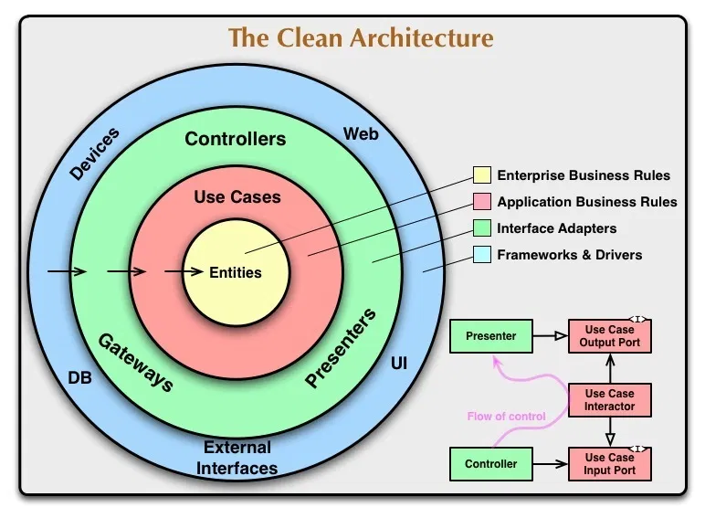

# TDD Clean Architecture Flutter Project

Пример разработки чистой архитектуры по TDD

## Оглавление
* [Системные требования](#системные-требования)
* [Полезные ссылки](#полезные-ссылки)
* [Схема](#схема)

## Системные требования
dart sdk: >=2.12.0 <3.0.0

## Полезные ссылки
* [Уроки (видео)](https://youtu.be/KjE2IDphA_U)
* [Уроки (сайт)](https://resocoder.com/2019/08/27/flutter-tdd-clean-architecture-course-1-explanation-project-structure/)

## Схема
